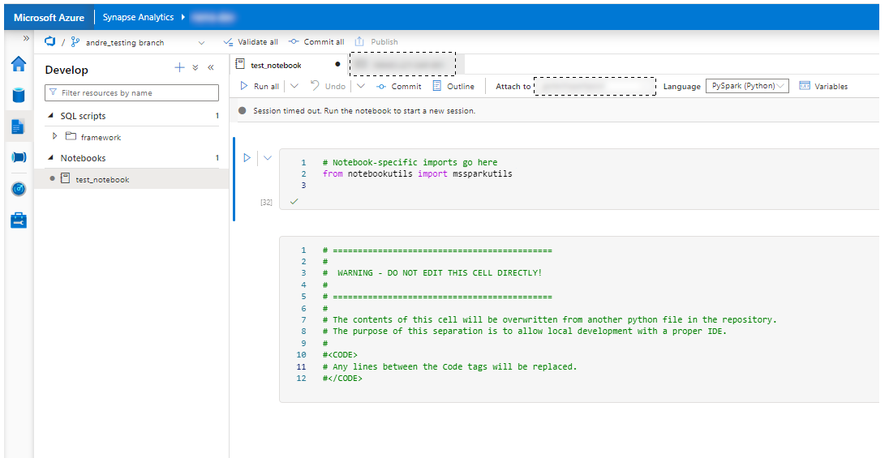

# populate-synapse-nb
Populate an Azure Synapse Analytics notebook from a separate python file. This allows code development in a local IDE, rather than in the web-based IDE.

# Installation

From terminal:

    pip install populate-synapse-nb

## Usage

1) Clone the Azure Synapse Repository to your local machine
2) Locate the folder 'notebooks', containing your notebooks in .json format.
3) Create a .py file containing the data you would like to import. It is recommended to use the same name / location.
4) Into your Azure Synapse Analytics notebook, create a new code cell and paste the following:

Code to be pasted to the Azure Synapse Analytics notebook cell:

    # ============================================
    #
    #  WARNING - DO NOT EDIT THIS CELL DIRECTLY!
    #
    # ============================================
    # 
    # The contents of this cell will be overwritten from a python file in the repository.
    # The purpose of this separation is to allow local development with a local IDE.
    # 
    #<CODE>
    # Any lines between the Code tags will be replaced.
    #</CODE>

5) Run the code as follows:

Python code

    from populate_synapse_nb import PopulateAzureSynapseNotebook

    populator = PopulateAzureSynapseNotebook(source_path, destination_path)
    populator.run()

Note, if source_path is not provided, it will use the current file.
If the destination path is not provided, it will use the source file path, but changing the extension from .py to .json.

